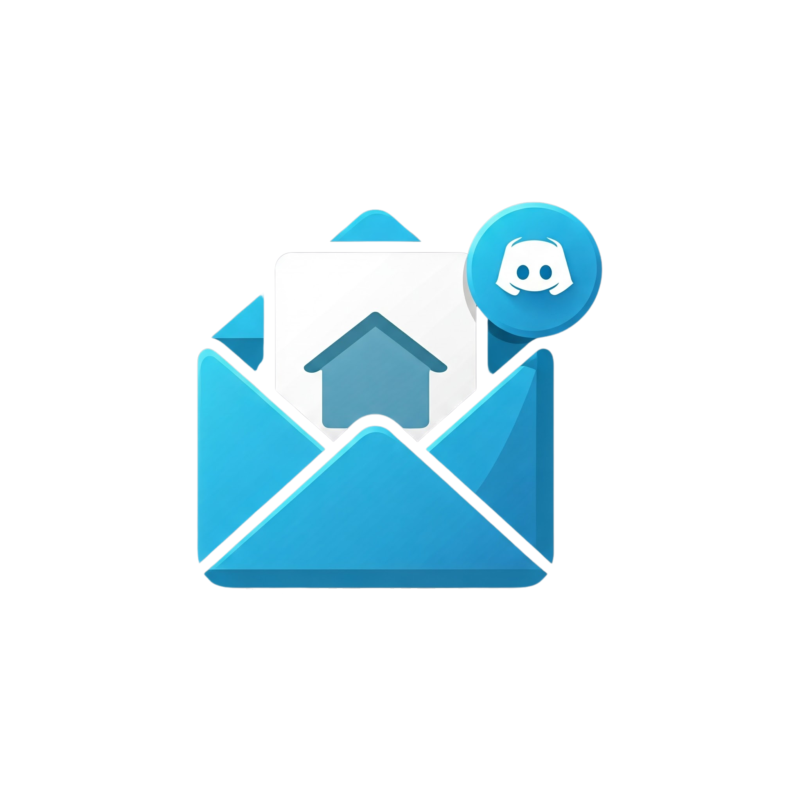
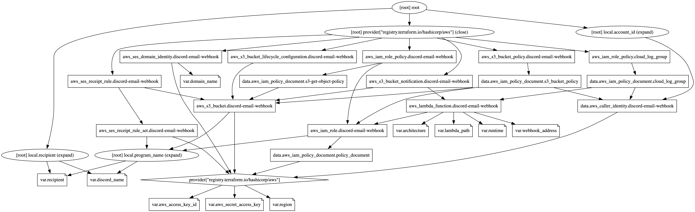

<!-- Improved compatibility of back to top link: See: https://github.com/othneildrew/Best-README-Template/pull/73 -->
<a id="readme-top"></a>
<!--
*** Thanks for checking out the Best-README-Template. If you have a suggestion
*** that would make this better, please fork the repo and create a pull request
*** or simply open an issue with the tag "enhancement".
*** Don't forget to give the project a star!
*** Thanks again! Now go create something AMAZING! :D
-->


<!-- PROJECT SHIELDS -->
<!--
*** I'm using markdown "reference style" links for readability.
*** Reference links are enclosed in brackets [ ] instead of parentheses ( ).
*** See the bottom of this document for the declaration of the reference variables
*** for contributors-url, forks-url, etc. This is an optional, concise syntax you may use.
*** https://www.markdownguide.org/basic-syntax/#reference-style-links
-->
[![Contributors][contributors-shield]][contributors-url]
[![Forks][forks-shield]][forks-url]
[![Stargazers][stars-shield]][stars-url]
[![Issues][issues-shield]][issues-url]
[![MIT][license-shield]][license-url]
[![Codecov][codecov-shield]][codecov-url]


<!-- PROJECT LOGO -->
<br />
<div align="center">
  <a href="https://github.com/Kevincav/Email-to-Discord-Webhook-Publisher">
    
  </a>

  <h3 align="center">Email to Discord Webhook Publisher</h3>

  <p align="center">
    <a href="https://github.com/Kevincav/Email-to-Discord-Webhook-Publisher"><strong>Explore the docs »</strong></a>
    <br />
    <br />
    <a href="https://github.com/Kevincav/Email-to-Discord-Webhook-Publisher">View Demo</a>
    ·
    <a href="https://github.com/Kevincav/Email-to-Discord-Webhook-Publisher/issues/new?labels=bug&template=bug-report---.md">Report Bug</a>
    ·
    <a href="https://github.com/Kevincav/Email-to-Discord-Webhook-Publisher/issues/new?labels=enhancement&template=feature-request---.md">Request Feature</a>
  </p>
</div>


<!-- ABOUT THE PROJECT -->
## Project Description

### **Email to Discord Webhook Publisher**

This project is designed to automate the process of forwarding emails to a Discord channel via a webhook. Using AWS services such as **Lambda**, **SES (Simple Email Service)**, and **S3**, this solution enables seamless email-to-webhook integration. The primary use case is for users who want to receive email alerts, notifications, or any other form of email communication directly in a Discord channel.

The idea for this project was inspired by the article ["Email to Discord Webhook with Amazon SES and AWS Lambda"](https://medium.com/@_jonas/email-to-discord-webhook-with-amazon-ses-and-aws-lambda-38154e2c1e49) by Jonas, which explains how to set up a simple email-to-Discord system using AWS SES and Lambda. The article provided a great starting point for this idea, but the goal here is to **fully automate the deployment and management** of the entire system using **Terraform** and **GitHub Actions**.

By leveraging infrastructure as code (IaC), the process of setting up AWS resources such as SES, S3, Lambda, and IAM roles is automated, making it easier to replicate and scale. This solution not only simplifies the setup but also allows for seamless updates and changes with minimal manual intervention.

<p align="right">(<a href="#readme-top">back to top</a>)</p>

### **Key Features:**

- **Email-to-Discord Integration**: Automatically sends the content of incoming emails to a specified Discord channel.
- **Automated Infrastructure Deployment**: Leverages Terraform and GitHub Actions to manage the AWS resources, ensuring infrastructure as code (IaC).
- **SES Email Handling**: Integrates AWS SES to handle email reception, verification, and rule-based routing.
- **Secure and Scalable**: Utilizes AWS IAM roles, policies, and Lambda to ensure secure and scalable processing of incoming emails.

<p align="right">(<a href="#readme-top">back to top</a>)</p>

### **Use Cases:**

- **Alerts and Notifications**: Automatically forward system or service alerts received via email to a Discord channel for real-time monitoring.
- **Email Parsing**: Parse and forward email contents to a team or group using Discord for collaboration.
- **Automation**: Automate workflows based on emails, such as receiving a report and forwarding it to a team instantly.

<p align="right">(<a href="#readme-top">back to top</a>)</p>

### **How It Works:**

1. **SES receives an email** sent to a pre-configured address.
2. **SES stores the email** in an S3 bucket.
3. The **Lambda function** is triggered by the newly stored email in S3.
4. The Lambda function extracts relevant email content and sends it to the specified **Discord Webhook URL**.
5. All required AWS resources (IAM roles, SES, Lambda, S3) are managed and deployed using Terraform for ease of use and repeatability.

This project is ideal for users who need a simple, scalable, and automated solution to forward emails to Discord channels for team collaboration, monitoring, or alerting purposes.


<p align="right">(<a href="#readme-top">back to top</a>)</p>

---

### Built With

* [![Scala][Scala.js]][Scala-url]
* [![Terraform][Terraform.js]][Terraform-url]

<p align="right">(<a href="#readme-top">back to top</a>)</p>

---

<!-- GETTING STARTED -->
## Getting Started Guide

This guide will walk you through setting up a new AWS account, creating AWS credentials, cloning the project repository, and configuring environmental variables and secrets required to deploy your infrastructure using Terraform.

<p align="right">(<a href="#readme-top">back to top</a>)</p>

### Prerequisites

- A **new AWS account**.
- A **GitHub** account with access to a repository for storing your code and secrets.
- Basic familiarity with **Terraform**, **AWS IAM**, and **GitHub Secrets**.

<p align="right">(<a href="#readme-top">back to top</a>)</p>

### 1. Create a New AWS Account

Follow these steps to create a new AWS account:

1. **Sign Up for AWS:**
    - Visit the [AWS Sign-Up Page](https://aws.amazon.com/).
    - Click on **Create a Free Account** and follow the steps to complete the sign-up process.

2. **Log into the AWS Management Console:**
    - Once you’ve created your AWS account, log in to the [AWS Management Console](https://aws.amazon.com/console/).

<p align="right">(<a href="#readme-top">back to top</a>)</p>

### 2. Create IAM User and AWS Access Keys

To interact with AWS services from GitHub Actions, you’ll need to create IAM credentials (Access Key ID and Secret Access Key).

1. **Navigate to IAM (Identity and Access Management):**
    - In the AWS Console, go to the **IAM Dashboard**: [IAM Dashboard](https://console.aws.amazon.com/iam/).

2. **Create a New IAM User:**
    - In the left sidebar, select **Users**, then click **Add user**.
    - Set a **Username** (e.g., `github-actions-user`).
    - For **Access type**, select **Programmatic access** to generate API credentials (Access Key ID and Secret Access Key).

3. **Attach Permissions:**
    - On the **Permissions** step, choose **Attach policies directly**.
    - Attach the **AdministratorAccess** policy (or create a custom policy if you need more fine-grained permissions).

4. **Download Credentials:**
    - After completing the wizard, **download the Access Key ID** and **Secret Access Key**. These will be used later in GitHub Actions.

<p align="right">(<a href="#readme-top">back to top</a>)</p>

### 3. Set Up AWS Secrets in GitHub

Now that you have your AWS credentials, you'll store them securely in GitHub Secrets to be accessed by GitHub Actions during deployment.

1. **Go to GitHub Secrets:**
    - In your GitHub repository, navigate to **Settings** (at the top of the repo page).
    - In the left sidebar, click **Secrets** under the **Security** section.

2. **Add the AWS Secrets:**
    - Click **New repository secret** and add the following secrets:
        - `AWS_ACCESS_KEY_ID`: Your AWS Access Key ID.
        - `AWS_SECRET_ACCESS_KEY`: Your AWS Secret Access Key.

These secrets will be used in GitHub Actions to authenticate with AWS during the deployment process.

<p align="right">(<a href="#readme-top">back to top</a>)</p>

### 4. Clone the Repository

Now that your AWS secrets are securely stored, you can clone the project repository that contains your Terraform code.

1. **Clone the Repository:**
    - Open a terminal and run the following command to clone the repository:
      ```bash
      git clone https://github.com/Kevincav/Email-to-Discord-Webhook-Publisher.git
      cd Email-to-Discord-Webhook-Publisher
      ```

<p align="right">(<a href="#readme-top">back to top</a>)</p>

### 5. Configure Environment Variables

You’ll need to configure several environment variables to customize the infrastructure deployment.

1. **Set the Required Variables:**
   Inside your cloned project, locate the `variables.tf` or `.env` file (depending on your setup). Add the following variables:

    - `discord_name`: Your Discord username or identifier (e.g., `mydiscord`).
    - `domain_name`: The domain name you are using with AWS SES (e.g., `mydomain.com`).
    - `lambda_path`: The path to your Lambda function code (e.g., `lambda/handler.zip`).
    - `recipient`: The email address that SES will process (e.g., `contact@mydomain.com`).

   Example `.env` or `terraform.tfvars` configuration:
   ```hcl
   discord_name = "mydiscord"
   domain_name = "mydomain.com"
   webhook_address = "discord webhook address"
   recipient = "contact@mydomain.com"

2. **Verify the Environment Variables:**

Ensure that these variables are set correctly. These values will be passed to the Terraform configuration for resource creation.

<p align="right">(<a href="#readme-top">back to top</a>)</p>

## 6. Deploying with GitHub Actions

Now that everything is set up, deploying your infrastructure is easy! When you push changes to the repository, the configured GitHub Actions workflow will automatically deploy your Terraform infrastructure.

1. **Push Changes to GitHub:**
    - In the terminal, stage, commit, and push your changes to GitHub:
      ```bash
      git add .
      git commit -m "Initial commit with environment variables"
      git push origin main
      ```

   GitHub Actions will automatically start the Terraform workflow defined in `.github/workflows/terraform-deploy.yml`.

2. **Monitor the Deployment:**
   You can monitor the progress of the deployment by checking the **Actions** tab in your GitHub repository. The workflow will run automatically whenever changes are pushed to the repository.

<p align="right">(<a href="#readme-top">back to top</a>)</p>

### Troubleshooting

If you encounter issues, here are some common troubleshooting tips:

- **Permissions Issues**:
    - Ensure that the IAM user has the necessary permissions to manage the AWS resources defined in your Terraform configuration. If you encounter permission errors, check that the `AdministratorAccess` policy (or equivalent custom policies) is attached to the IAM user.

- **Missing or Incorrect Secrets**:
    - Double-check that the correct AWS credentials (`AWS_ACCESS_KEY_ID`, `AWS_SECRET_ACCESS_KEY`, `AWS_REGION`) and environment variables (`discord_name`, `domain_name`, `lambda_path`, `recipient`) are set both locally and in GitHub Secrets. Missing secrets or incorrectly named secrets could prevent the deployment from running successfully.

- **Terraform Errors**:
    - If Terraform reports errors during `terraform apply`, check your Terraform configuration files for syntax issues or misconfigurations. Errors might also appear if the AWS resources you're creating conflict with existing resources or if permissions are lacking.

- **GitHub Actions Failures**:
    - If the GitHub Actions workflow fails, check the logs in the **Actions** tab of your repository. The logs will give you detailed error messages that can help you pinpoint any issues with the deployment process.

<p align="right">(<a href="#readme-top">back to top</a>)</p>

### Conclusion

You’ve now created a new AWS account, configured your AWS credentials, cloned the repository, set the required environment variables, and added your secrets to GitHub. With GitHub Actions configured, your infrastructure is ready to be deployed automatically using Terraform.

If everything is set up correctly, GitHub Actions will handle the infrastructure deployment for you, automating the creation and management of AWS resources like Lambda, S3, SES, and IAM roles.

Happy deploying! 🎉

<p align="right">(<a href="#readme-top">back to top</a>)</p>

---

<!-- ARCHITECTURE -->
## AWS Architecture Overview

This document provides an architectural overview of the system designed to process incoming emails and send them to a Discord webhook using AWS services. The system utilizes IAM, Lambda, S3, and SES in the following manner.

### Workflow

<div align="center">

</div>

<p align="right">(<a href="#readme-top">back to top</a>)</p>

### Terraform

<div align="center">

</div> 

<p align="right">(<a href="#readme-top">back to top</a>)</p>


### 1. IAM (Identity and Access Management)

#### Resources Involved:
- `aws_iam_role` (Role for Lambda)
- `aws_iam_role_policy` (Role policies)
- `aws_s3_bucket_policy` (S3 bucket policy)

#### Architectural Overview:
- **IAM Role for Lambda:**  
  The role `discord-email-webhook` is assigned to the Lambda function to grant it the necessary permissions to interact with other AWS resources like S3 and CloudWatch Logs. It assumes the `sts:AssumeRole` permission, allowing AWS Lambda to execute under this role.

- **Role Policies:**  
  Two policies are attached to the IAM role:
    1. **S3 Access Policy (`s3-get-object-policy`)**: Grants the Lambda function permission to `GetObject` from the S3 bucket (`discord-email-webhook`).
    2. **CloudWatch Logs Policy (`cloud_log_group`)**: Grants Lambda permission to create log groups, log streams, and log events, enabling logging of Lambda invocations.

- **S3 Bucket Policy:**  
  The `s3_bucket_policy` allows Lambda (`AllowLambdaGets`) and SES (`AllowSESPuts`) to interact with the S3 bucket:
    1. **Lambda:** Can retrieve objects from the S3 bucket.
    2. **SES:** Can put objects (e.g., email data) into the S3 bucket.

<p align="right">(<a href="#readme-top">back to top</a>)</p>

### 2. Lambda Function

#### Resources Involved:
- `aws_lambda_function` (Lambda function)

#### Architectural Overview:
- **Lambda Function:**  
  The `discord-email-webhook` Lambda function is set up to process events triggered by S3 bucket uploads. It uses the `java21` runtime and a specific function handler (`EmailWebhookHandler::handleEvent`), indicating that the Lambda is written in Java.
    - **Environment Variables:** The Lambda is configured with environment variables, such as the Discord webhook URL (`WEBHOOK_ADDRESS`) and a flag to disable Java deprecation warnings.
    - **Trigger:** The Lambda function will be triggered when new objects are added to the S3 bucket (`discord-email-webhook`) based on the S3 notification configuration.

<p align="right">(<a href="#readme-top">back to top</a>)</p>

### 3. S3 Buckets

#### Resources Involved:
- `aws_s3_bucket` (S3 bucket)
- `aws_s3_bucket_lifecycle_configuration` (S3 object lifecycle policy)
- `aws_s3_bucket_notification` (S3 event notification)

#### Architectural Overview:
- **S3 Bucket (`discord-email-webhook`):**  
  This bucket is used to store email data processed by SES before being passed to the Lambda function. The bucket is named with a dynamic pattern based on the program name.

- **Lifecycle Configuration:**  
  The S3 bucket has a lifecycle policy (`ExpireObjects`) to automatically expire objects (email data) 7 days after they are created, ensuring data is not stored indefinitely.

- **Bucket Notifications:**  
  The bucket is configured to trigger the Lambda function when objects are created. The events that trigger the Lambda function are `s3:ObjectCreated:Put` and `s3:ObjectCreated:Post`. This ensures the Lambda function is invoked whenever a new email or object is uploaded to the bucket by SES.

<p align="right">(<a href="#readme-top">back to top</a>)</p>

### 4. SES (Simple Email Service)

#### Resources Involved:
- `aws_ses_domain_identity` (Domain verification)
- `aws_ses_receipt_rule_set` (Rule set)
- `aws_ses_receipt_rule` (Receipt rule)

#### Architectural Overview:
- **SES Domain Identity:**  
  SES is configured to verify a domain (`discord-email-webhook`), which ensures that emails sent to the domain are processed securely.

- **Receipt Rule Set:**  
  A receipt rule set is defined to manage how incoming emails are processed. This set is identified with the name `${local.program_name}-rule-set`, linking it to the specific program.

- **Receipt Rule:**  
  The receipt rule processes incoming emails that match the specified recipient (`var.recipient`). After receiving the email, SES triggers an action to store the email object in the S3 bucket (`discord-email-webhook`), using the `S3` action within the rule. This action stores the email in the bucket before further processing by the Lambda function.

<p align="right">(<a href="#readme-top">back to top</a>)</p>

### Key Flow Overview

1. **Email Sent to SES:**
    - An email is sent to a recipient (e.g., `var.recipient`). SES receives the email and checks if the domain is verified and the recipient matches the rule.

2. **SES Stores Email in S3:**
    - SES stores the email data in the configured S3 bucket (`discord-email-webhook`) using the receipt rule and its associated `S3` action.

3. **S3 Notification Triggers Lambda:**
    - The creation of an object in the S3 bucket (email data) triggers the S3 bucket notification, invoking the Lambda function (`discord-email-webhook`).

4. **Lambda Processes Email:**
    - The Lambda function processes the email data (perhaps formatting it or extracting relevant information) and sends it to a Discord webhook (`WEBHOOK_ADDRESS`) for further action, like notification or logging.

<p align="right">(<a href="#readme-top">back to top</a>)</p>

### Variables Overview

#### Input Variables:
- `aws_access_key_id`, `aws_secret_access_key`: AWS credentials (should be securely managed).
- `discord_name`, `domain_name`, `recipient`, `webhook_address`: User-specific configuration (Discord name, SES domain, webhook URL, etc.).
- `lambda_path`: Path to the Lambda function code.
- `architecture`, `runtime`, `region`: AWS runtime and region configurations.

#### Local Variables:
- `account_id`, `program_name`, `recipient`: Dynamically generated based on the input variables, ensuring consistent naming and configurations throughout the Terraform resources.

<p align="right">(<a href="#readme-top">back to top</a>)</p>

### Architectural Summary

This setup leverages multiple AWS services to create an automated pipeline that:

1. Receives emails via SES.
2. Stores the email data in an S3 bucket.
3. Triggers a Lambda function to process the email and send it to a Discord webhook.

The architecture is focused on automating email-to-Discord notifications using a combination of IAM roles/policies, Lambda, SES, and S3. Each service is tightly integrated with others to ensure smooth operation, security (via IAM), and scalability (via Lambda and S3). The lifecycle policies on S3 ensure that email data is not stored indefinitely, helping with cost management.

<p align="right">(<a href="#readme-top">back to top</a>)</p>

---


<!-- ROADMAP -->
## Roadmap

- [ ] Feature 1
- [ ] Feature 2
- [ ] Feature 3
    - [ ] Nested Feature

See the [open issues](https://github.com/Kevincav/Email-to-Discord-Webhook-Publisher/issues) for a full list of proposed features (and known issues).

<p align="right">(<a href="#readme-top">back to top</a>)</p>

---


<!-- CONTRIBUTING -->
## Contributing

Contributions are what make the open source community such an amazing place to learn, inspire, and create. Any contributions you make are **greatly appreciated**.

If you have a suggestion that would make this better, please fork the repo and create a pull request. You can also simply open an issue with the tag "enhancement".
Don't forget to give the project a star! Thanks again!

1. Fork the Project
2. Create your Feature Branch (`git checkout -b feature/AmazingFeature`)
3. Commit your Changes (`git commit -m 'Add some AmazingFeature'`)
4. Push to the Branch (`git push origin feature/AmazingFeature`)
5. Open a Pull Request

<p align="right">(<a href="#readme-top">back to top</a>)</p>

---

### Top contributors:

<a href="https://github.com/Kevincav/Email-to-Discord-Webhook-Publisher/graphs/contributors">
  
</a>

---

<!-- LICENSE -->
## License

Distributed under the MIT license. See `LICENSE.txt` for more information.

<p align="right">(<a href="#readme-top">back to top</a>)</p>

---

<!-- CONTACT -->
## Contact

Project Link: [https://github.com/Kevincav/Email-to-Discord-Webhook-Publisher](https://github.com/Kevincav/Email-to-Discord-Webhook-Publisher)

<p align="right">(<a href="#readme-top">back to top</a>)</p>

---

<!-- ACKNOWLEDGMENTS -->
## Acknowledgments

* Thanks for all the hard work done by Jonas on medium to create the groundwork needed to scale to full automation. [Medium Article](https://medium.com/@_jonas/email-to-discord-webhook-with-amazon-ses-and-aws-lambda-38154e2c1e49)

<p align="right">(<a href="#readme-top">back to top</a>)</p>


<!-- MARKDOWN LINKS & IMAGES -->
<!-- https://www.markdownguide.org/basic-syntax/#reference-style-links -->
[contributors-shield]: https://img.shields.io/github/contributors/Kevincav/Email-to-Discord-Webhook-Publisher.svg?style=for-the-badge?
[contributors-url]: https://github.com/Kevincav/Email-to-Discord-Webhook-Publisher/graphs/contributors
[forks-shield]: https://img.shields.io/github/forks/Kevincav/Email-to-Discord-Webhook-Publisher.svg?style=for-the-badge?
[forks-url]: https://github.com/Kevincav/Email-to-Discord-Webhook-Publisher/network/members
[stars-shield]: https://img.shields.io/github/stars/Kevincav/Email-to-Discord-Webhook-Publisher.svg?style=for-the-badge?
[stars-url]: https://github.com/Kevincav/Email-to-Discord-Webhook-Publisher/stargazers
[issues-shield]: https://img.shields.io/github/issues/Kevincav/Email-to-Discord-Webhook-Publisher.svg?style=for-the-badge?
[issues-url]: https://github.com/Kevincav/Email-to-Discord-Webhook-Publisher/issues
[license-shield]: https://img.shields.io/github/license/Kevincav/Email-to-Discord-Webhook-Publisher.svg?style=for-the-badge?
[license-url]: https://github.com/Kevincav/Email-to-Discord-Webhook-Publisher/blob/master/LICENSE.txt
[linkedin-shield]: https://img.shields.io/badge/-LinkedIn-black.svg?style=for-the-badge&logo=linkedin&colorB=555
[linkedin-url]: https://linkedin.com/in/linkedin_username
[product-screenshot]: images/screenshot.png
[Next.js]: https://img.shields.io/badge/next.js-000000?style=for-the-badge&logo=nextdotjs&logoColor=white
[Next-url]: https://nextjs.org/
[React.js]: https://img.shields.io/badge/React-20232A?style=for-the-badge&logo=react&logoColor=61DAFB
[React-url]: https://reactjs.org/
[Vue.js]: https://img.shields.io/badge/Vue.js-35495E?style=for-the-badge&logo=vuedotjs&logoColor=4FC08D
[Vue-url]: https://vuejs.org/
[Angular.io]: https://img.shields.io/badge/Angular-DD0031?style=for-the-badge&logo=angular&logoColor=white
[Angular-url]: https://angular.io/
[Svelte.dev]: https://img.shields.io/badge/Svelte-4A4A55?style=for-the-badge&logo=svelte&logoColor=FF3E00
[Svelte-url]: https://svelte.dev/
[Laravel.com]: https://img.shields.io/badge/Laravel-FF2D20?style=for-the-badge&logo=laravel&logoColor=white
[Laravel-url]: https://laravel.com
[Bootstrap.com]: https://img.shields.io/badge/Bootstrap-563D7C?style=for-the-badge&logo=bootstrap&logoColor=white
[Bootstrap-url]: https://getbootstrap.com
[JQuery.com]: https://img.shields.io/badge/jQuery-0769AD?style=for-the-badge&logo=jquery&logoColor=white
[JQuery-url]: https://jquery.com
[Scala.js]: https://img.shields.io/badge/Scala-20232A?style=for-the-badge&logo=scala&logoColor=61DAFB
[Scala-url]: https://www.scala-lang.org/
[aoc-shield]: https://img.shields.io/badge/Advent%20Of%20Code-0769AD?style=for-the-badge&logo=adventofcode&logoColor=white
[aoc-url]: https://adventofcode.com/
[Github-actions.js]: https://img.shields.io/badge/Github%20Actions-20232A?style=for-the-badge&logo=githubactions&logoColor=61DAFB
[Github-actions-url]: https://github.com/features/actions
[SQLite.js]: https://img.shields.io/badge/SQLite-20232A?style=for-the-badge&logo=sqlite&logoColor=61DAFB
[SQLite-url]: https://www.sqlite.org/
[Terraform.js]: https://img.shields.io/badge/Terraform-20232A?style=for-the-badge&logo=terraform&logoColor=61DAFB
[Terraform-url]: https://www.terraform.io/
[Codecov-shield]: https://codecov.io/gh/Kevincav/Email-to-Discord-Webhook-Publisher/graph/badge.svg?token=WOHkRdjJHb
[Codecov-url]: https://codecov.io/gh/Kevincav/Email-to-Discord-Webhook-Publisher
