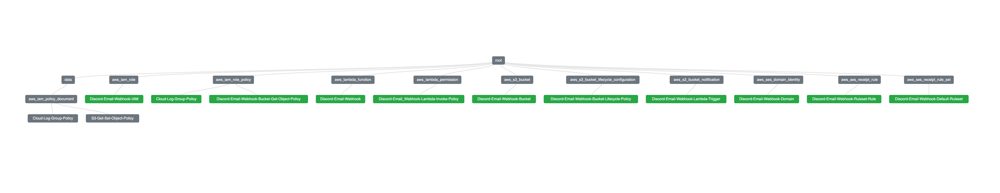

<!-- Improved compatibility of back to top link: See: https://github.com/othneildrew/Best-README-Template/pull/73 -->
<a id="readme-top"></a>
<!--
*** Thanks for checking out the Best-README-Template. If you have a suggestion
*** that would make this better, please fork the repo and create a pull request
*** or simply open an issue with the tag "enhancement".
*** Don't forget to give the project a star!
*** Thanks again! Now go create something AMAZING! :D
-->


<!-- PROJECT SHIELDS -->
<!--
*** I'm using markdown "reference style" links for readability.
*** Reference links are enclosed in brackets [ ] instead of parentheses ( ).
*** See the bottom of this document for the declaration of the reference variables
*** for contributors-url, forks-url, etc. This is an optional, concise syntax you may use.
*** https://www.markdownguide.org/basic-syntax/#reference-style-links
-->
[![Contributors][contributors-shield]][contributors-url]
[![Forks][forks-shield]][forks-url]
[![Stargazers][stars-shield]][stars-url]
[![Issues][issues-shield]][issues-url]
[![MIT][license-shield]][license-url]


<!-- PROJECT LOGO -->
<br />
<div align="center">
  <a href="https://github.com/Kevincav/Email-to-Discord-Webhook-Publisher">
    
  </a>

<h3 align="center">Email to Discord Publisher</h3>

  <p align="center">
    This project publishes a message to a discord webhook upon receiving an email. It uses AWS services to automate the process.
    <br />
    <a href="https://github.com/Kevincav/Email-to-Discord-Webhook-Publisher"><strong>Explore the docs »</strong></a>
    <br />
    <br />
    <a href="https://github.com/Kevincav/Email-to-Discord-Webhook-Publisher">View Demo</a>
    ·
    <a href="https://github.com/Kevincav/Email-to-Discord-Webhook-Publisher/issues/new?labels=bug&template=bug-report---.md">Report Bug</a>
    ·
    <a href="https://github.com/Kevincav/Email-to-Discord-Webhook-Publisher/issues/new?labels=enhancement&template=feature-request---.md">Request Feature</a>
  </p>
</div>


<!-- ABOUT THE PROJECT -->
## About The Project

Several years ago, a user named Jonas on [Medium](https://medium.com/@_jonas/email-to-discord-webhook-with-amazon-ses-and-aws-lambda-38154e2c1e49)
wrote a wonderful article on how to utilize AWS services to automate the process to forward an email to a discord server upon receipt.
Most of the work is done with manual creations and permissions, the goal of this project is to streamline the process by automating
everything through terraform. As well as create a Scala version of the script instead of Python (personal challenge) like the original source.
This project will automate the process of creating an IAM role, its policies, the Lambda function, S3 bucket and SES through terraform scripts. Then deploy
with github actions.

<p align="right">(<a href="#readme-top">back to top</a>)</p>

---

### Built With

* [![Scala][Scala.js]][Scala-url]
* [![Terraform][Terraform.js]][Terraform-url]

<p align="right">(<a href="#readme-top">back to top</a>)</p>

---

<!-- GETTING STARTED -->
## Getting Started

This is an example of how you may give instructions on setting up your project locally.
To get a local copy up and running follow these simple example steps.

### Prerequisites

This is an example of how to list things you need to use the software and how to install them.
* npm
  ```sh
  npm install npm@latest -g
  ```

### Installation

1. Get a free API Key at [https://example.com](https://example.com)
2. Clone the repo
   ```sh
   git clone https://github.com/Kevincav/Email-to-Discord-Webhook-Publisher.git
   ```
3. Install NPM packages
   ```sh
   npm install
   ```
4. Enter your API in `config.js`
   ```js
   const API_KEY = 'ENTER YOUR API';
   ```
5. Change git remote url to avoid accidental pushes to base project
   ```sh
   git remote set-url origin Kevincav/Email-to-Discord-Webhook-Publisher
   git remote -v # confirm the changes
   ```

<p align="right">(<a href="#readme-top">back to top</a>)</p>

<!-- USAGE EXAMPLES -->
## Usage

Use this space to show useful examples of how a project can be used. Additional screenshots, code examples and demos work well in this space. You may also link to more resources.

_For more examples, please refer to the [Documentation](https://example.com)_

<p align="right">(<a href="#readme-top">back to top</a>)</p>

---

<!-- ARCHITECTURE -->
## AWS Architecture Overview

This document provides an architectural overview of the system designed to process incoming emails and send them to a Discord webhook using AWS services. The system utilizes IAM, Lambda, S3, and SES in the following manner.

### Workflow

<div align="center">

</div>

<p align="right">(<a href="#readme-top">back to top</a>)</p>

### Terraform

<div align="center">

</div> 

<p align="right">(<a href="#readme-top">back to top</a>)</p>


### 1. IAM (Identity and Access Management)

#### Resources Involved:
- `aws_iam_role` (Role for Lambda)
- `aws_iam_role_policy` (Role policies)
- `aws_s3_bucket_policy` (S3 bucket policy)

#### Architectural Overview:
- **IAM Role for Lambda:**  
  The role `discord-email-webhook` is assigned to the Lambda function to grant it the necessary permissions to interact with other AWS resources like S3 and CloudWatch Logs. It assumes the `sts:AssumeRole` permission, allowing AWS Lambda to execute under this role.

- **Role Policies:**  
  Two policies are attached to the IAM role:
    1. **S3 Access Policy (`s3-get-object-policy`)**: Grants the Lambda function permission to `GetObject` from the S3 bucket (`discord-email-webhook`).
    2. **CloudWatch Logs Policy (`cloud_log_group`)**: Grants Lambda permission to create log groups, log streams, and log events, enabling logging of Lambda invocations.

- **S3 Bucket Policy:**  
  The `s3_bucket_policy` allows Lambda (`AllowLambdaGets`) and SES (`AllowSESPuts`) to interact with the S3 bucket:
    1. **Lambda:** Can retrieve objects from the S3 bucket.
    2. **SES:** Can put objects (e.g., email data) into the S3 bucket.

<p align="right">(<a href="#readme-top">back to top</a>)</p>

### 2. Lambda Function

#### Resources Involved:
- `aws_lambda_function` (Lambda function)

#### Architectural Overview:
- **Lambda Function:**  
  The `discord-email-webhook` Lambda function is set up to process events triggered by S3 bucket uploads. It uses the `java21` runtime and a specific function handler (`EmailWebhookHandler::handleEvent`), indicating that the Lambda is written in Java.
    - **Environment Variables:** The Lambda is configured with environment variables, such as the Discord webhook URL (`WEBHOOK_ADDRESS`) and a flag to disable Java deprecation warnings.
    - **Trigger:** The Lambda function will be triggered when new objects are added to the S3 bucket (`discord-email-webhook`) based on the S3 notification configuration.

<p align="right">(<a href="#readme-top">back to top</a>)</p>

### 3. S3 Buckets

#### Resources Involved:
- `aws_s3_bucket` (S3 bucket)
- `aws_s3_bucket_lifecycle_configuration` (S3 object lifecycle policy)
- `aws_s3_bucket_notification` (S3 event notification)

#### Architectural Overview:
- **S3 Bucket (`discord-email-webhook`):**  
  This bucket is used to store email data processed by SES before being passed to the Lambda function. The bucket is named with a dynamic pattern based on the program name.

- **Lifecycle Configuration:**  
  The S3 bucket has a lifecycle policy (`ExpireObjects`) to automatically expire objects (email data) 7 days after they are created, ensuring data is not stored indefinitely.

- **Bucket Notifications:**  
  The bucket is configured to trigger the Lambda function when objects are created. The events that trigger the Lambda function are `s3:ObjectCreated:Put` and `s3:ObjectCreated:Post`. This ensures the Lambda function is invoked whenever a new email or object is uploaded to the bucket by SES.

<p align="right">(<a href="#readme-top">back to top</a>)</p>

### 4. SES (Simple Email Service)

#### Resources Involved:
- `aws_ses_domain_identity` (Domain verification)
- `aws_ses_receipt_rule_set` (Rule set)
- `aws_ses_receipt_rule` (Receipt rule)

#### Architectural Overview:
- **SES Domain Identity:**  
  SES is configured to verify a domain (`discord-email-webhook`), which ensures that emails sent to the domain are processed securely.

- **Receipt Rule Set:**  
  A receipt rule set is defined to manage how incoming emails are processed. This set is identified with the name `${local.program_name}-rule-set`, linking it to the specific program.

- **Receipt Rule:**  
  The receipt rule processes incoming emails that match the specified recipient (`var.recipient`). After receiving the email, SES triggers an action to store the email object in the S3 bucket (`discord-email-webhook`), using the `S3` action within the rule. This action stores the email in the bucket before further processing by the Lambda function.

<p align="right">(<a href="#readme-top">back to top</a>)</p>

### Key Flow Overview

1. **Email Sent to SES:**
    - An email is sent to a recipient (e.g., `var.recipient`). SES receives the email and checks if the domain is verified and the recipient matches the rule.

2. **SES Stores Email in S3:**
    - SES stores the email data in the configured S3 bucket (`discord-email-webhook`) using the receipt rule and its associated `S3` action.

3. **S3 Notification Triggers Lambda:**
    - The creation of an object in the S3 bucket (email data) triggers the S3 bucket notification, invoking the Lambda function (`discord-email-webhook`).

4. **Lambda Processes Email:**
    - The Lambda function processes the email data (perhaps formatting it or extracting relevant information) and sends it to a Discord webhook (`WEBHOOK_ADDRESS`) for further action, like notification or logging.

<p align="right">(<a href="#readme-top">back to top</a>)</p>

### Variables Overview

#### Input Variables:
- `aws_access_key_id`, `aws_secret_access_key`: AWS credentials (should be securely managed).
- `discord_name`, `domain_name`, `recipient`, `webhook_address`: User-specific configuration (Discord name, SES domain, webhook URL, etc.).
- `lambda_path`: Path to the Lambda function code.
- `architecture`, `runtime`, `region`: AWS runtime and region configurations.

#### Local Variables:
- `account_id`, `program_name`, `recipient`: Dynamically generated based on the input variables, ensuring consistent naming and configurations throughout the Terraform resources.

<p align="right">(<a href="#readme-top">back to top</a>)</p>

### Architectural Summary

This setup leverages multiple AWS services to create an automated pipeline that:

1. Receives emails via SES.
2. Stores the email data in an S3 bucket.
3. Triggers a Lambda function to process the email and send it to a Discord webhook.

The architecture is focused on automating email-to-Discord notifications using a combination of IAM roles/policies, Lambda, SES, and S3. Each service is tightly integrated with others to ensure smooth operation, security (via IAM), and scalability (via Lambda and S3). The lifecycle policies on S3 ensure that email data is not stored indefinitely, helping with cost management.

<p align="right">(<a href="#readme-top">back to top</a>)</p>

---


<!-- ROADMAP -->
## Roadmap

- [ ] Feature 1
- [ ] Feature 2
- [ ] Feature 3
    - [ ] Nested Feature

See the [open issues](https://github.com/Kevincav/Email-to-Discord-Webhook-Publisher/issues) for a full list of proposed features (and known issues).

<p align="right">(<a href="#readme-top">back to top</a>)</p>

---


<!-- CONTRIBUTING -->
## Contributing

Contributions are what make the open source community such an amazing place to learn, inspire, and create. Any contributions you make are **greatly appreciated**.

If you have a suggestion that would make this better, please fork the repo and create a pull request. You can also simply open an issue with the tag "enhancement".
Don't forget to give the project a star! Thanks again!

1. Fork the Project
2. Create your Feature Branch (`git checkout -b feature/AmazingFeature`)
3. Commit your Changes (`git commit -m 'Add some AmazingFeature'`)
4. Push to the Branch (`git push origin feature/AmazingFeature`)
5. Open a Pull Request

<p align="right">(<a href="#readme-top">back to top</a>)</p>

---

### Top contributors:

<a href="https://github.com/Kevincav/Email-to-Discord-Webhook-Publisher/graphs/contributors">
  
</a>

---

<!-- LICENSE -->
## License

Distributed under the MIT license. See `LICENSE.txt` for more information.

<p align="right">(<a href="#readme-top">back to top</a>)</p>

---

<!-- CONTACT -->
## Contact

Project Link: [https://github.com/Kevincav/Email-to-Discord-Webhook-Publisher](https://github.com/Kevincav/Email-to-Discord-Webhook-Publisher)

<p align="right">(<a href="#readme-top">back to top</a>)</p>

---

<!-- ACKNOWLEDGMENTS -->
## Acknowledgments

* Thanks for all the hard work done by Jonas on medium to create the groundwork needed to scale to full automation. [Medium Article](https://medium.com/@_jonas/email-to-discord-webhook-with-amazon-ses-and-aws-lambda-38154e2c1e49)

<p align="right">(<a href="#readme-top">back to top</a>)</p>


<!-- MARKDOWN LINKS & IMAGES -->
<!-- https://www.markdownguide.org/basic-syntax/#reference-style-links -->
[contributors-shield]: https://img.shields.io/github/contributors/Kevincav/Email-to-Discord-Webhook-Publisher.svg?style=for-the-badge
[contributors-url]: https://github.com/Kevincav/Email-to-Discord-Webhook-Publisher/graphs/contributors
[forks-shield]: https://img.shields.io/github/forks/Kevincav/Email-to-Discord-Webhook-Publisher.svg?style=for-the-badge
[forks-url]: https://github.com/Kevincav/Email-to-Discord-Webhook-Publisher/network/members
[stars-shield]: https://img.shields.io/github/stars/Kevincav/Email-to-Discord-Webhook-Publisher.svg?style=for-the-badge
[stars-url]: https://github.com/Kevincav/Email-to-Discord-Webhook-Publisher/stargazers
[issues-shield]: https://img.shields.io/github/issues/Kevincav/Email-to-Discord-Webhook-Publisher.svg?style=for-the-badge
[issues-url]: https://github.com/Kevincav/Email-to-Discord-Webhook-Publisher/issues
[license-shield]: https://img.shields.io/github/license/Kevincav/Email-to-Discord-Webhook-Publisher.svg?style=for-the-badge
[license-url]: https://github.com/Kevincav/Email-to-Discord-Webhook-Publisher/blob/master/LICENSE.txt
[linkedin-shield]: https://img.shields.io/badge/-LinkedIn-black.svg?style=for-the-badge&logo=linkedin&colorB=555
[linkedin-url]: https://linkedin.com/in/linkedin_username
[product-screenshot]: images/screenshot.png
[Next.js]: https://img.shields.io/badge/next.js-000000?style=for-the-badge&logo=nextdotjs&logoColor=white
[Next-url]: https://nextjs.org/
[React.js]: https://img.shields.io/badge/React-20232A?style=for-the-badge&logo=react&logoColor=61DAFB
[React-url]: https://reactjs.org/
[Vue.js]: https://img.shields.io/badge/Vue.js-35495E?style=for-the-badge&logo=vuedotjs&logoColor=4FC08D
[Vue-url]: https://vuejs.org/
[Angular.io]: https://img.shields.io/badge/Angular-DD0031?style=for-the-badge&logo=angular&logoColor=white
[Angular-url]: https://angular.io/
[Svelte.dev]: https://img.shields.io/badge/Svelte-4A4A55?style=for-the-badge&logo=svelte&logoColor=FF3E00
[Svelte-url]: https://svelte.dev/
[Laravel.com]: https://img.shields.io/badge/Laravel-FF2D20?style=for-the-badge&logo=laravel&logoColor=white
[Laravel-url]: https://laravel.com
[Bootstrap.com]: https://img.shields.io/badge/Bootstrap-563D7C?style=for-the-badge&logo=bootstrap&logoColor=white
[Bootstrap-url]: https://getbootstrap.com
[JQuery.com]: https://img.shields.io/badge/jQuery-0769AD?style=for-the-badge&logo=jquery&logoColor=white
[JQuery-url]: https://jquery.com
[Scala.js]: https://img.shields.io/badge/Scala-20232A?style=for-the-badge&logo=scala&logoColor=61DAFB
[Scala-url]: https://www.scala-lang.org/
[aoc-shield]: https://img.shields.io/badge/Advent%20Of%20Code-0769AD?style=for-the-badge&logo=adventofcode&logoColor=white
[aoc-url]: https://adventofcode.com/
[Github-actions.js]: https://img.shields.io/badge/Github%20Actions-20232A?style=for-the-badge&logo=githubactions&logoColor=61DAFB
[Github-actions-url]: https://github.com/features/actions
[SQLite.js]: https://img.shields.io/badge/SQLite-20232A?style=for-the-badge&logo=sqlite&logoColor=61DAFB
[SQLite-url]: https://www.sqlite.org/
[Terraform.js]: https://img.shields.io/badge/Terraform-20232A?style=for-the-badge&logo=terraform&logoColor=61DAFB
[Terraform-url]: https://www.terraform.io/

